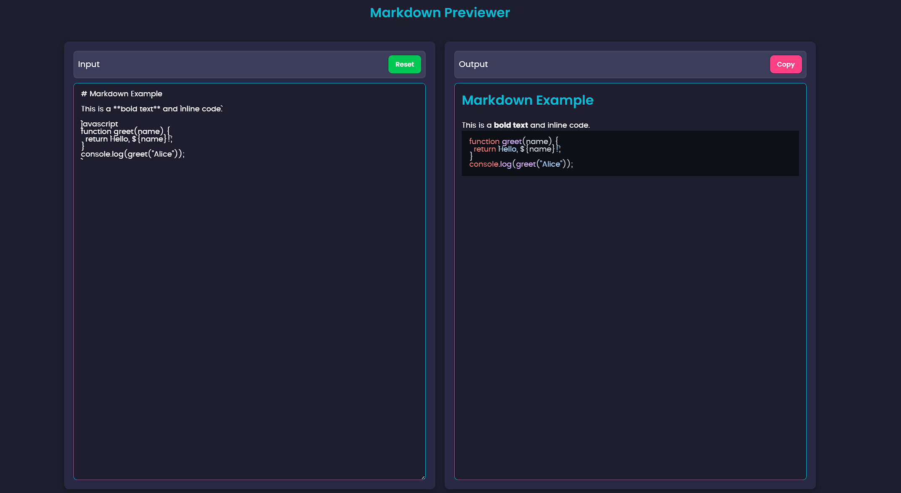

# Markdown Previewer

## 🚀 Overview
This is a simple **Markdown Previewer** that allows users to write Markdown in a text area and see the formatted output in real-time. The project uses **Marked.js** for parsing Markdown and **Highlight.js** for syntax highlighting.

## 🛠️ Features
- **Real-time Markdown preview** ✍️
- **Syntax highlighting for code blocks** 💻
- **Copy output to clipboard** 📋
- **Reset input with a single click** 🔄
- **Dark-themed UI with modern design** 🎨
- **Responsive layout for mobile & desktop** 📱

## 📌 Technologies Used
- **HTML5** - Structure of the web page
- **CSS3** - Styling and layout
- **JavaScript (ES6+)** - Functionality
- **Marked.js** - Markdown parser
- **Highlight.js** - Syntax highlighting

## 📂 Project Structure
```
├── index.html       # Main HTML file
├── style.css        # Stylesheet for the project
├── app.js           # JavaScript functionality
├── README.md        # Documentation
```

## 🔧 Setup & Usage
### 1️⃣ Clone the Repository
```
git clone https://github.com/your-username/markdown-previewer.git
cd markdown-previewer
```

### 2️⃣ Open in Browser
Simply open the `index.html` file in your favorite browser.

### 3️⃣ Edit & Test
Modify `app.js` or `style.css` to customize the project.

## ⚡ How It Works
1. Type Markdown text in the **Input** textarea.
2. The formatted Markdown appears in the **Output** section.
3. Code blocks are automatically highlighted.
4. Use the **Copy** button to copy the output.
5. Use the **Reset** button to clear the input.

## 📸 Screenshots


## 🤝 Contributing
Feel free to **fork** this repository and submit pull requests if you have improvements!

## 📜 License
This project is licensed under the **MIT License**.

---

💡 **Have any questions?** Feel free to reach out! 🚀

